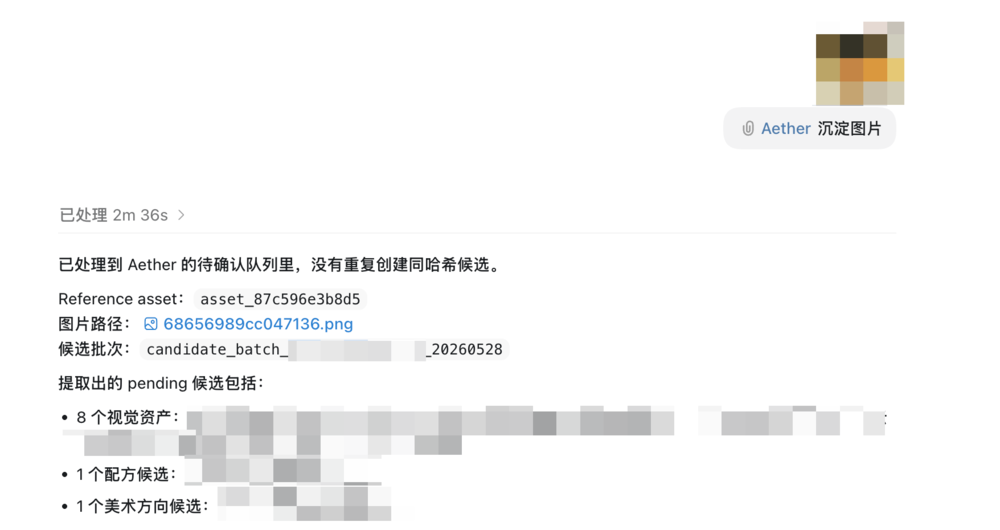
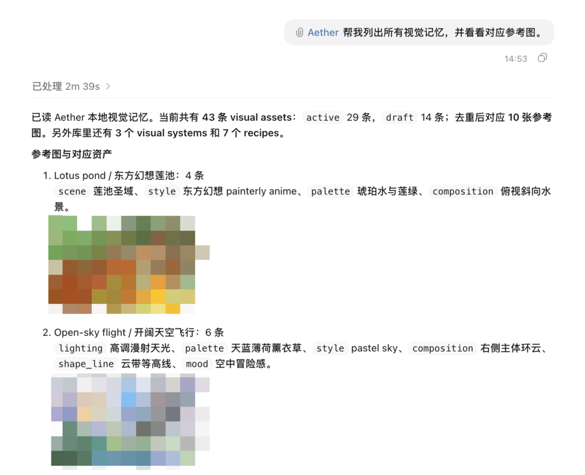
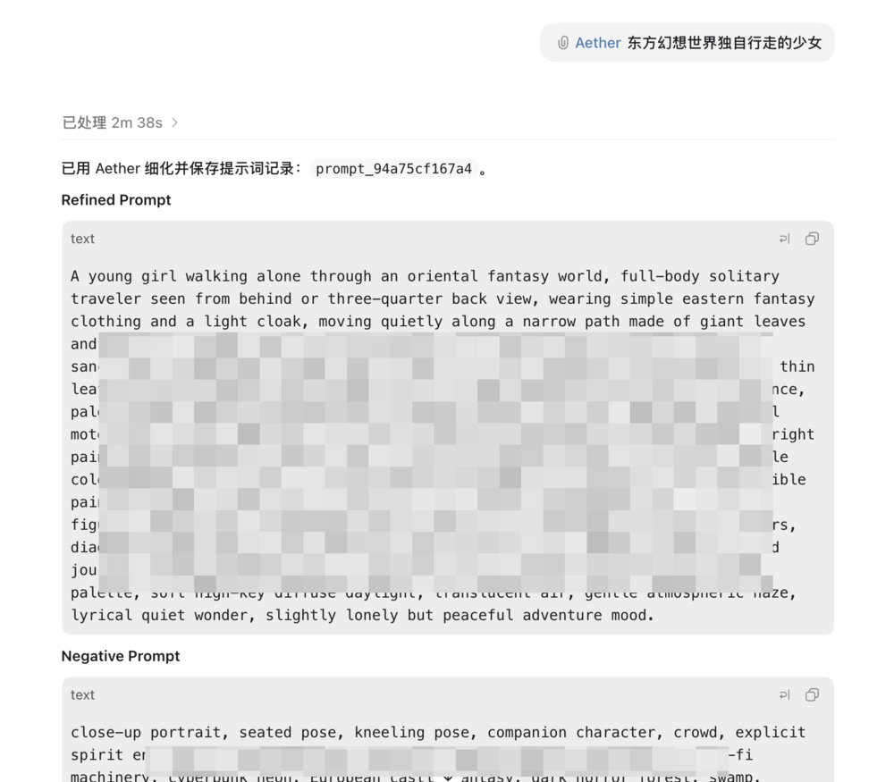
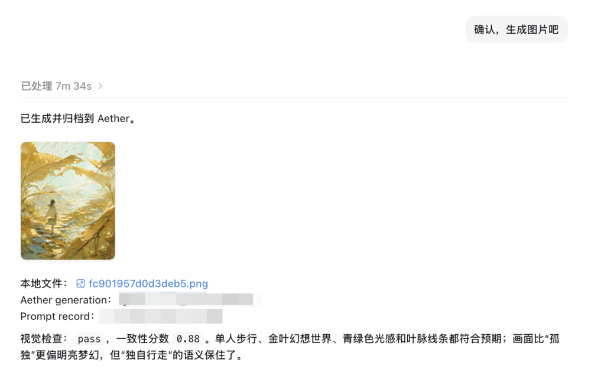
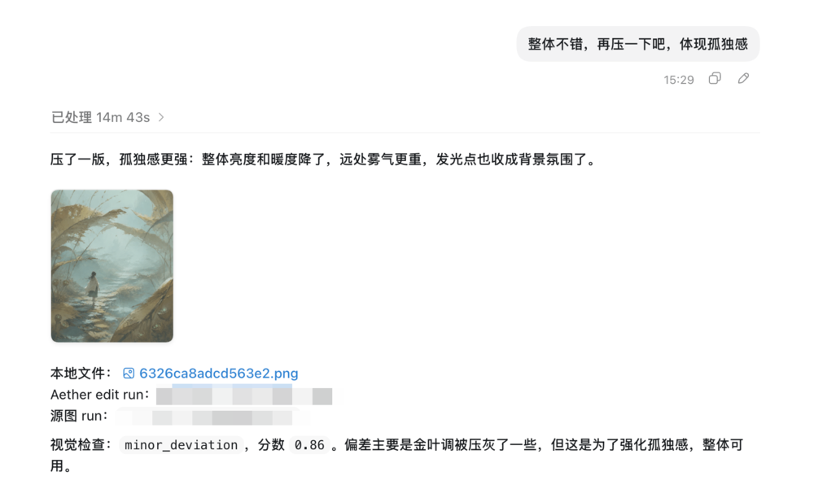

# Aether


English | [简体中文](README.md)

Aether turns reference images, prompt ideas, and generated results into reusable visual memory, helping you keep creating images with a consistent aesthetic direction.

## Core Capabilities

- **Reusable visual memory:** Extract stable visual language from reference images and generated results, then save it as memory that can be reused over time instead of one-off prompt text.
- **Memory-aware prompt refinement:** Recall saved style, lighting, palette, composition, mood, scene, character, and negative rules, then combine them into a more stable prompt while preserving the user's original intent.
- **Evolvable visual systems:** Decide whether new visual material should become new memory, be added to existing memory, be saved as a variant, or become a merge candidate, so the visual library can grow without becoming chaotic.
- **Generation feedback loop:** Record generated results, visual consistency reviews, and user feedback, so later prompts can reuse what worked and avoid known drift.
- **Natural-language workflow:** Use natural language to complete the full process of capturing, refining, generating, and reusing visual memory.

## Quick Start

Install with npm:

```bash
npx aether-codex-plugin install
```

Verify the local installation:

```bash
aether doctor
```

Restart Codex after installation, or open a new thread so the plugin skills can reload.

## Example Results

> The examples use `gpt-image-2`. Results may vary across image models.

| Reference | Generated |
| --- | --- |
|  |  |
|  |  |
|  |  |

## Usage

After installation, invoke Aether as a Codex plugin with `@Aether`, or as a skill with `$aether-orchestrator`. Aether automatically chooses the right workflow from your natural-language request.

| Workflow | Example |
| --- | --- |
| Capture visual memory |  |
| Browse visual memory |  |
| Refine prompts |  |
| Generate images |  |
| Edit images |  |

## License

MIT. See [LICENSE](LICENSE).
